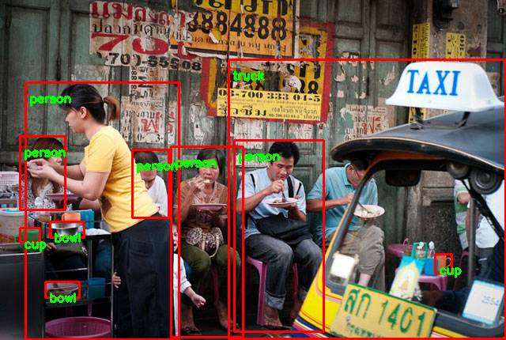
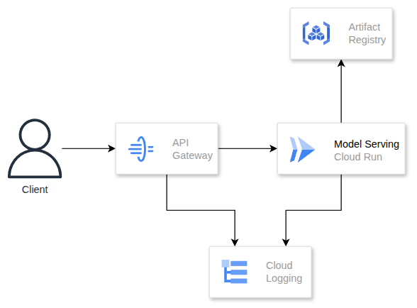
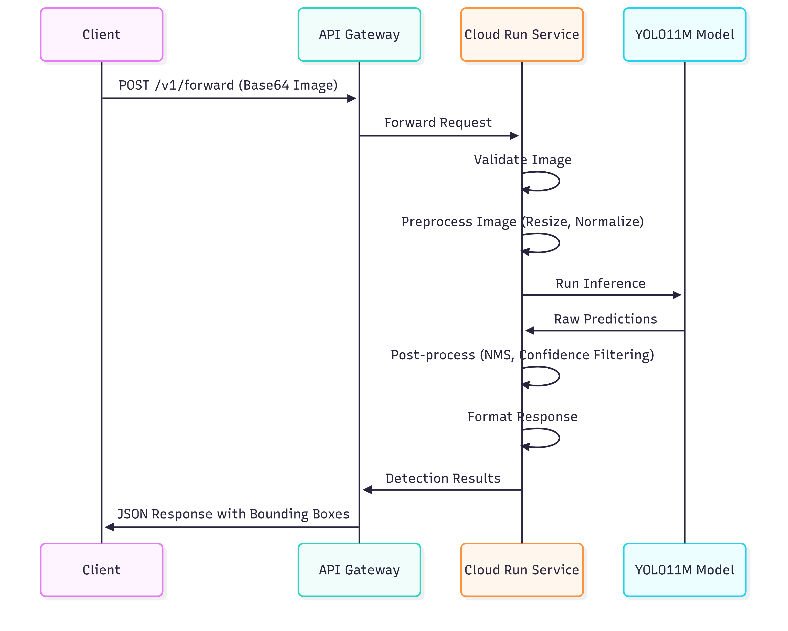
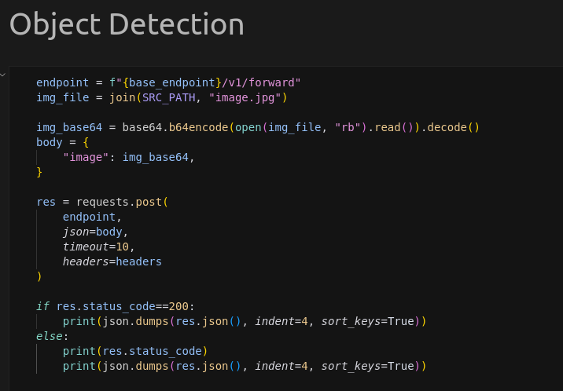

# Object Detection REST Serving

[](https://github.com/ambv/black)
[](https://www.python.org/downloads/)
[](https://fastapi.tiangolo.com/)
[](https://onnxruntime.ai/)

A high-performance REST API service for real-time object detection using YOLO11M model with ONNX Runtime, built with FastAPI and deployed on Google Cloud Platform.

## Table of Contents

-   [Overview](#overview)
-   [Architecture](#architecture)
-   [Prerequisites](#prerequisites)
-   [Local Development](#local-development)
-   [Running the Service Locally](#running-the-service-locally)
-   [Testing](#testing)
-   [API Documentation](#api-documentation)

## Overview

This service provides a REST API for object detection using the YOLO11M model optimized with ONNX Runtime. It can detect 80 different object classes from the COCO dataset and returns bounding boxes, confidence scores, and class labels for detected objects.



### Key Features:

-   **Real-time Object Detection**: Process images and return detection results in milliseconds
-   **80 COCO Classes**: Detect common objects like people, vehicles, animals, and everyday items
-   **RESTful API**: Simple HTTP endpoints for easy integration
-   **Cloud-Native**: Designed for deployment on Google Cloud Platform
-   **Scalable**: Built with FastAPI for high-performance serving
-   **Production Ready**: Includes health checks, logging, and monitoring
-   **CI/CD**: Automated testing, building, and deployment pipelines

## Architecture

### System Overview



### Data Flow



### Technology Stack

-   **Backend Framework**: FastAPI (Python 3.12)
-   **ML Runtime**: ONNX Runtime 1.22.1
-   **Computer Vision**: OpenCV 4.12.0
-   **Model**: YOLO11M (ONNX format)
-   **Infrastructure**: Google Cloud Platform
-   **Container**: Docker
-   **Orchestration**: Cloud Run
-   **CI/CD**: Github Action
-   **API Gateway**: Google Cloud API Gateway
-   **Infrastructure as Code**: CDKTF
-   **Configuration**: Dynaconf
-   **Logging**: Structured JSON logging

### Project Structure

```
object-detection-rest-serving/
├── src/                    # Main application source code
│   ├── main.py            # FastAPI application entry point
│   ├── config.py          # Configuration management
│   ├── models/            # ML model implementations
│   │   └── object_detector.py
│   ├── routers/           # API route definitions
│   │   ├── health_check.py
│   │   └── v1/
│   │       └── forward.py
│   └── utils/             # Utility functions and middleware
│
├── infra/                 # Infrastructure as Code (CDKTF)
│   ├── src/
│   │   ├── main.py        # CDKTF application entry point
│   │   ├── config.py      # Infrastructure configuration
│   │   ├── construct/     # CDKTF constructs
│   │   └── infrastructure/ # Infrastructure components
│   └── pyproject.toml     # Infrastructure dependencies
│
├── tests/                 # Test suite
│   ├── conftest.py        # Pytest configuration
│   ├── models/            # Model tests
│   ├── routers/           # API route tests
│   └── utils/             # Utility function tests
│
├── configs/               # Application configuration files
├── docker/                # Docker configuration
├── notebooks/             # Jupyter notebooks for testing
├── resources/             # Model files
└── .github/               # GitHub workflows
```

## Prerequisites

### Installing Required Tools

-   **Python 3.12+**:
-   **Poetry**: [Installation guide](https://python-poetry.org/docs/#installation)
-   **Docker**: [Download Docker Desktop](https://www.docker.com/products/docker-desktop)
-   **Git**

### Others

-   GCP Service Account Key (will be provided separatly via email)

## Local Development

### 1. Clone the Repository

```bash
git clone https://github.com/UdbT/object-detection-rest-serving.git
cd object-detection-rest-serving
```

### 2. Install Dependencies

This project uses Poetry for dependency management:

```bash
# Install project dependencies
poetry install
```

### 3. Download Model

The YOLO11M model file is managed with DVC. Download it:

```bash
# Set GOOGLE_APPLICATION_CREDENTIALS
export GOOGLE_APPLICATION_CREDENTIALS="<key-path>"

# Pull the model file
poetry run dvc pull
```

## Running the Service Locally

### Option 1: Direct Python Execution

```bash
# Run the FastAPI application
poetry run uvicorn src.main:app --host 0.0.0.0 --port 8000 --reload
```

### Option 2: Using Docker Compose

```bash
# Build and run with Docker Compose
docker-compose -f docker/docker-compose.yaml up --build

# Or

make run
```

The service will be available at `http://localhost:8000`

### Verify Service

```bash
# Health check
curl http://localhost:8000/health_check
```

## Testing

### Run Unit tests

```bash
# Run all tests with coverage
make pytest
```

### Manual API Testing

#### Option 1: Using CURL command line

```bash
curl -X POST "http://localhost:8000/v1/forward" \
  -H "Content-Type: application/json" \
  -d '{
    "image": "base64_encoded_image_string"
  }'
```

#### Option 2: Using the notebook provided in the `notebooks/` directory



### Interactive Documentation

-   **Local**: http://localhost:8000/docs

### Code Quality

```bash
# Format code
make format

# Lint code
make lint

# Run tests
make pytest

# Pre-commit hooks (if configured)
pre-commit run --all-files
```

### Adding Dependencies

```bash
# Add production dependency
poetry add package-name

# Add development dependency
poetry add --group dev package-name
```

### Updating Dependencies

```bash
# Update all dependencies
poetry update

# Update specific package
poetry update package-name
```
